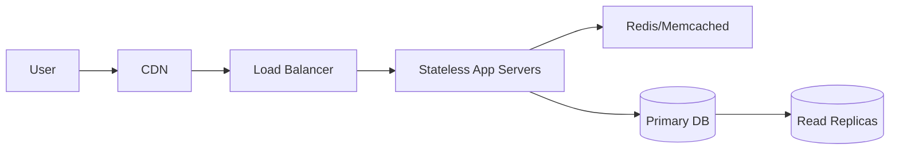
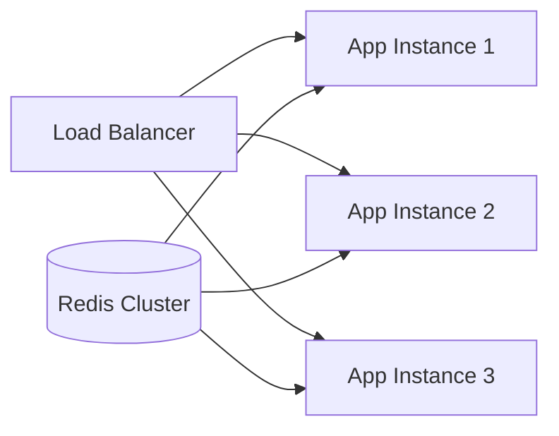

Building applications that scale reliably is neither guesswork nor brute force—it’s the result of deliberate architectural choices, disciplined engineering, and constant measurement. Over the years, working with systems that ranged from small internal tools to large-scale distributed platforms, I’ve gathered a set of lessons that consistently prove their value.

## Start with the Right Foundation

Most scalability issues are self-inflicted. They originate in early architectural shortcuts that eventually choke the system. Good foundations aren’t optional—they’re the difference between a system that grows and a system that implodes.

- **Choose the right database model**: Understand the trade-offs between SQL (ACID, relational integrity) and NoSQL (flexible schema, horizontal scaling). Pick based on data access patterns, not trends.
- **Design services to be stateless**: Persist session data externally so new instances can be added or removed without draining traffic.
- **Build with caching in mind**: You’ll end up caching anyway. Doing it late means rewriting half the system. Identify hot paths, expensive queries, and slow integrations early.
- **Anticipate data growth**: Partitioning, sharding, and archive strategies should be part of the initial design discussion, not last-minute patches.

A scalable system is rarely a monolith of clever tricks—it’s a set of simple, well-understood patterns applied consistently.

Here’s a high-level scalable architecture, the one most teams eventually converge toward:



## The Three Pillars of Scalability

### 1. Vertical Scaling

Vertical scaling is simple: buy a bigger machine. That’s why teams love it. But simplicity is deceptive.

* **It works—briefly.** You get an instant performance bump.
* **It caps out—fast.** CPU and RAM ceilings are absolute. You will hit them.
* **It gets expensive—absurdly so.** A slightly larger instance costs dramatically more.
* **It keeps your single point of failure intact.**

Vertical scaling is useful, but it is not a strategy—it's a temporary pressure valve.

### 2. Horizontal Scaling

If you want serious traffic, you need more machines—containers, nodes, replicas, whatever. Horizontal scaling is where real scalability begins.

* **Nearly infinite growth**: Just add more instances.
* **Better reliability**: Machines can fail without user impact.
* **Requires discipline**: Statelessness, idempotent operations, clean APIs.
* **Infrastructure gets more complex**: Load balancers, autoscalers, container orchestration.

But once you have this in place, scaling is a matter of configuration, not panic.



This is the modern baseline—anything less is fragile.

### 3. Caching

The unsung hero of high-performance systems.

- Use Redis or Memcached to offload session and frequently accessed data.
- Leverage CDNs for global distribution of static assets.
- Layer caching: browser → CDN → reverse proxy → application → database.
- Apply conservative yet meaningful TTLs; set invalidation rules early.

Good caching often yields the single biggest performance improvement at the smallest cost.

## Database Optimization

The database is usually the real bottleneck—and the hardest subsystem to scale.

- **Index what matters**: Target frequent lookups and filters; remove unused indexes that slow writes.
- **Use connection pooling**: Prevent connection storms and reduce handshake overhead.
- **Separate reads and writes**: Read replicas offload analytical and reporting queries.
- **Shard strategically**: Partition by user, region, or logical group when datasets become unmanageable.
- **Avoid over-fetching**: Small endpoints scale better than "return everything" APIs.

Databases demand discipline—carelessness here becomes a long-term tax.


## Architecting for Failure

No scalable system is complete without failure planning.

- Replicate critical services across zones or regions.
- Design for graceful degradation: partial functionality beats complete downtime.
- Apply circuit breakers, retries with backoff, and timeouts across all service calls.
- Evaluate disaster recovery strategies—RPO/RTO matter when things go wrong.

High availability is not a feature; it’s an obligation.


## Monitoring, Observability, and Telemetry

Scaling requires insight. Guesswork is expensive.

- Centralize logs with Elasticsearch, Loki, or cloud-native alternatives.
- Instrument services with metrics: latency, throughput, error rate, saturation.
- Use distributed tracing (Jaeger, OpenTelemetry) to understand cross-service interactions.
- Automate alerts for anomalies—not just failures.

Observability transforms the system from opaque to predictable.

## Load Testing and Capacity Planning

Test your assumptions before production users test them for you.

```bash
# Example using Apache Bench
ab -n 10000 -c 100 https://your-api.com/endpoint
```
In addition to AB, consider:

* **k6** for realistic scenario scripting.
* **Locust** for Python-based load simulation.
* **JMeter** for complex enterprise scenarios.

Benchmark, profile, and stress-test continuously—capacity is never “set and forgotten.”

## DevOps and Deployment Strategy

Scalability is not just code—it’s pipelines, automation, and operational rigor.

* **Infrastructure as Code**: Use Terraform or Pulumi for reproducible environments.
* **Containerization**: Docker standardizes runtime environments.
* **Orchestration**: Kubernetes or ECS enables automated scaling and healing.
* **Blue-Green or Canary Deployments**: Minimize downtime and risk.

A scalable system requires scalable operations.

## Common Pitfalls

* **Premature optimization**: Don’t optimize what you can’t measure.
* **Ignoring the data layer**: Code scales easily; databases do not.
* **Single-threaded thinking**: Assume everything can fail at any time.
* **No observability**: Blind optimization leads to wasted effort.
* **Overcomplication**: Scaling is not about fashionable patterns—just effective ones.

## Conclusion

Scalability is an ongoing process—observe, measure, adjust. Build for the present but design with future growth in mind. Keep the architecture simple, predictable, and evolvable. When done well, scaling stops being a crisis and becomes a routine operation.

The systems that scale aren’t the ones with the most “clever” architecture—they’re the ones whose fundamentals were done right from the beginning.

Remember: the best architecture is one that can evolve with your application's needs.
